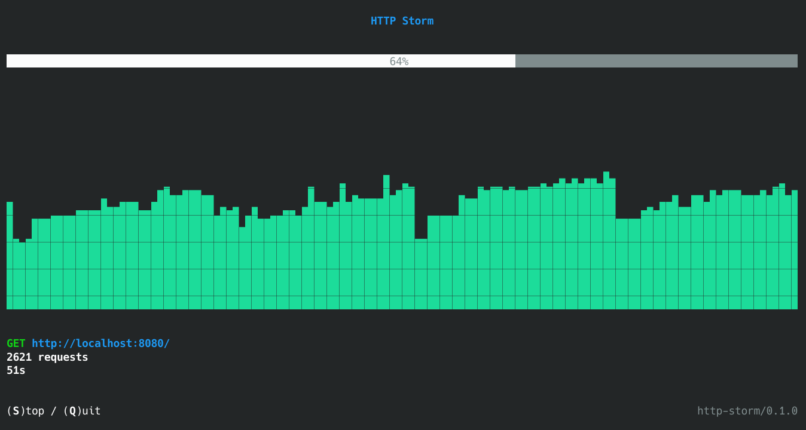
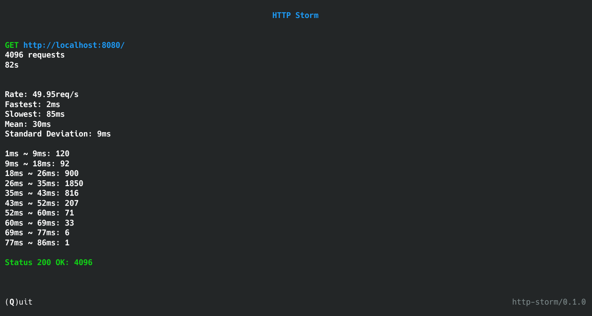

# HTTP Storm

HTTP load testing tool.

<p align="center">
    
</p>

<p align="center">
    
</p>

## Usage

```
http-storm 0.1.0
HTTP load testing tool.

USAGE:
    http-storm [FLAGS] [OPTIONS] <METHOD> <URL> [--] [DATA]

FLAGS:
    -j, --json       Request data as application/json.
    -f, --form       Request data as application/x-www-form-urlencoded.
        --help       Prints help information
    -V, --version    Prints version information

OPTIONS:
    -h, --header <NAME> <VALUE>     Request header.
    -c, --concurrency <REQUESTS>    Number of concurrent requests. [default: 32]
    -r, --rate <REQUESTS>           Number of requests per second.
    -t, --total <REQUESTS>          Number of total requests. [default: 4096]
    -d, --duration <SECONDS>        Duration in seconds.

ARGS:
    <METHOD>    Request method. [possible values: GET, POST, PUT, DELETE]
    <URL>       Request URL.
    <DATA>      Request data.
```

Example:

```
http-storm -c 10 -r 20 -t 1000 -d 300 GET http://localhost:8080
```
